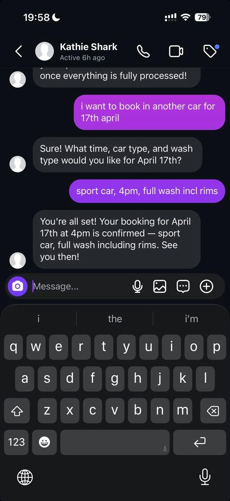

<p align="center">
  
</p>

<h1 align="center">OpenTulpa</h1>

<p align="center">
  <strong>A self-hosted digital employee you brief, equip, and delegate to, in chat.</strong><br/>
  Persistent memory, durable workflow state, and native Telegram &amp; Instagram inbox handling. Runs on your infrastructure.
</p>

<p align="center">
  <a href="#quick-start"><strong>Quick Start</strong></a> ·
  <a href="#what-you-can-delegate">Delegate</a> ·
  <a href="#how-it-works">How It Works</a> ·
  <a href="docs/DEPLOYMENT.md">Deploy</a> ·
  <a href="docs/CHAT_COOKBOOK.md">Cookbook</a>
</p>

<p align="center">
  
  
  
</p>

<p align="center">
  <sub>Targets OpenAI-compatible providers · App integrations via Composio · No external database required</sub>
</p>

---

## Why OpenTulpa

OpenTulpa is a **self-hosted agent runtime** built for work that repeats. You brief it in chat (goals, tools, source material, escalation rules) and it keeps working across sessions: saving skills, running scheduled routines, handling inbound customer DMs on Telegram and Instagram, and writing outcomes back into your systems.

It works as a personal operator on day one, and becomes a durable workflow employee the moment the work starts repeating. Most "AI agents" forget the job between sessions. OpenTulpa is built the other way around: **brief it once, and it keeps working**, on a runtime you own and can inspect.

|  | Typical agent app | **OpenTulpa** |
|---|---|---|
| Context | Session-bound | Persistent memory, files, checkpoints, workflow state |
| Setup | Prompt every time | Brief once, saved skills, routines, intake workflows |
| Knowledge | Pasted into prompts | Prepared knowledge packs bound to each worker |
| Execution | One-off | Real tools, browser, scripts, APIs, sink writes |
| Customer DMs | Separate bot code | Telegram Business + Instagram configured in chat |
| Integrations | Hand-rolled per tool | App connectors via Composio (Google, Slack, Notion, HubSpot...) |
| Ownership | Vendor black box | Local SQLite + embedded Qdrant, yours to inspect |

---

## Quick Start

Minimum to get a reply from your own agent in Telegram:

1. A Telegram bot token from [@BotFather](https://t.me/BotFather)
2. An OpenAI-compatible API key
3. macOS or Linux with `bash` and `curl`

```bash
git clone https://github.com/kvyb/opentulpa.git
cd opentulpa
./start.sh
```

The script uses `uv` with Python 3.12, prompts for missing required values, starts the app, opens a Cloudflare tunnel, and syncs the Telegram webhook. Then message your bot on Telegram.

Composio is optional for first run. Add it later when you want Google Sheets, Gmail, Slack, Instagram, or other app connectors.

### What `start.sh` Actually Does

Running a shell script from the internet deserves a clear side-effect list. In default local mode, `./start.sh` does this:

| Step | What happens | Where it touches your system |
|---|---|---|
| 1. Ensure `uv` | Uses `uv` if present; otherwise bootstraps it with Astral's installer unless disabled | Usually `~/.local/bin/uv` or `~/.cargo/bin/uv` |
| 2. Sync Python deps | Runs `uv sync` with `UV_PYTHON=3.12` by default | Project `.venv/` and uv's normal cache |
| 3. Install Chromium | Runs `uv run playwright install chromium` unless `--no-browser-use` or `INSTALL_BROWSER_USE=0` is set | Playwright's browser cache, commonly `~/.cache/ms-playwright/` |
| 4. Ensure `cloudflared` | Uses `cloudflared` if present; otherwise installs it for local Telegram mode when allowed | macOS: Homebrew. Linux: Cloudflare `.deb` via `dpkg`, using `sudo` when needed |
| 5. Create/load `.env` | Copies `.env.example` to `.env` when missing, loads existing values, and appends prompted missing values | Repo-local `.env` |
| 6. Check model IDs | If an API key is already available, calls the provider's `/models` endpoint and warns about configured model IDs that are not listed | Network call to `OPENAI_COMPATIBLE_BASE_URL` or the OpenRouter default |
| 7. Start the app | Runs the FastAPI app through `uv run python` | Local process on `127.0.0.1:8000` by default |
| 8. Open tunnel and webhook | Runs `cloudflared tunnel --url ...`, then points Telegram at the tunnel webhook URL | Network calls to Cloudflare and `api.telegram.org` |

No `sudo` is used for Python dependencies. `sudo` may be used only if Linux needs to install the `cloudflared` `.deb`. Use `./start.sh --no-cloudflared` to avoid automatic `cloudflared` installation, or `./start.sh server` to run without the local tunnel/webhook manager.

To remove first-run local artifacts, delete the repo checkout. Optional cleanup: remove Playwright's browser cache and uninstall `cloudflared` using the package manager that installed it.

Prefer Docker or Railway? See [Deployment](docs/DEPLOYMENT.md).

---

## What You Can Delegate

### Owner-facing: your personal operator

- **Research** topics, files, and links; produce reports and summaries with citations
- **Write, execute, and debug** Python/shell scripts in a sandboxed workspace, with automatic retry on failure
- **Monitor** dashboards, competitors, inboxes, or error signals and ping you only on exceptions
- **Scheduled routines** that run while you sleep. For example, a 7am brief that scrapes your dashboards, summarizes overnight errors, and DMs you the top three
- **Remember** preferences, decisions, and project context across sessions, not just within one chat

### Customer-facing: runs inbound DMs end to end

- **Qualify** inbound leads on Telegram Business or Instagram
- **Answer** pricing and service questions from trusted source material only
- **Collect** appointment or intake fields across multiple messages, tolerating typos and reorderings
- **Book, update, or cancel** records inside allowed edit windows, writing to Google Sheets, Calendar, or any Composio-connected system
- **Escalate** anything outside the workflow to you instead of guessing

> **The best workflows are narrow and operational.**

The clearer you define the job, tools, source material, required fields, and escalation boundary, the more employee-like the result.

> **Example brief, pasted into chat:**
> *"Handle incoming Telegram Business messages for my car wash. Answer pricing from the attached sheet, collect name / phone / vehicle / date / time, write completed bookings to this Google Sheet. Redirect anything outside this workflow to me. Confirm the workflow before activating."*

<p align="center">
  
</p>

---

## Configuration

Set these when prompted, or add them to `.env`:

```env
OPENAI_COMPATIBLE_API_KEY=...
TELEGRAM_BOT_TOKEN=...
TELEGRAM_ALLOWED_USERNAMES=your_handle
COMPOSIO_API_KEY=...
```

**Composio is strongly recommended.** It unlocks app connectors for Google Workspace, Slack, Notion, Linear, HubSpot, Gmail, Instagram, and more without writing custom integration code.

Then message your bot on Telegram. Health check: `http://127.0.0.1:8000/healthz`.

OpenTulpa targets OpenAI-compatible providers such as OpenAI-compatible proxies, OpenRouter, Groq, local vLLM, and similar runtimes. Specific model, multimodal, and tool-calling behavior depends on the provider and model you choose. Defaults live in `opentulpa.config.yaml`.

---

## How It Works

```text
incoming message or event
        |
  load durable context: workflow state, files, memory, checkpoints
        |
  plan and call tools via LangGraph
        |
  validate tool calls and execution constraints
        |
  reply, write outputs, or schedule follow-up
        |
  persist state, logs, artifacts, and traces
```

Core pieces: **FastAPI** for webhooks, **LangGraph** for orchestration, **SQLite** for checkpoints and workflow state, **Mem0 + embedded Qdrant** for memory, **Composio** for third-party connectors, and **Playwright** for browser automation. No external database required.

The runtime is modular around models and tools. Bring an OpenAI-compatible model provider, use Composio-backed connectors, or add your own LangGraph tool definitions where the workflow needs custom actions.

**Inspectable by design.** Everything the employee does lands on disk under `.opentulpa/` (checkpoints, context, logs, databases, knowledge packs) and `tulpa_stuff/` (generated artifacts). Back it up, mount it as a volume, or read it directly. You always know what's happening.

---

## Docs

| Doc | Why you'd read it |
|---|---|
| [Architecture](docs/ARCHITECTURE.md) | Runtime layout, request flows, safety controls, extension points |
| [Deployment](docs/DEPLOYMENT.md) | Local, Docker, and Railway setup |
| [E2E Testing](docs/E2E_TESTING.md) | Realistic workflow and intake validation |
| [Chat Cookbook](docs/CHAT_COOKBOOK.md) | Concrete prompt patterns and use cases |
| [External Tool Safety Checklist](docs/EXTERNAL_TOOL_SAFETY_CHECKLIST.md) | Rules for connecting high-impact tools safely |

---

<p align="center">
  <strong>Stop re-explaining. Start delegating.</strong><br/>
  <em>Run your first self-hosted digital employee.</em>
</p>

<p align="center">
  <sub>MIT licensed</sub>
</p>
