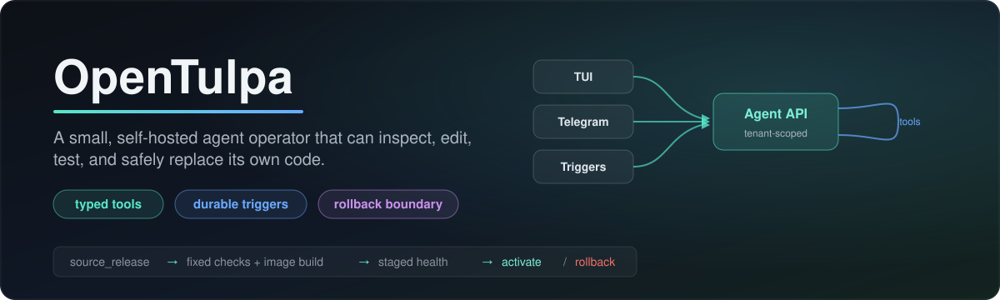

  

  <strong>A small, self-hosted Deep Agents operator that can inspect, edit, test, and safely replace its own code.</strong> 
  One Agent API, explicit tools, durable triggers, and a fixed rollback boundary.

  <code>TUI</code> &middot; <code>Telegram</code> &middot; <code>Triggers</code> &rarr; one tenant-scoped <strong>Agent API</strong>

## What It Does

OpenTulpa is one persistent agent with multiple replaceable ways to reach it. The local
terminal client, Telegram worker, schedules, intake, browser automation, and future
integrations all submit work through the same tenant-scoped Agent API. They do not own
their own model loops or conversation stores.

[`deepagents==0.6.12`](https://github.com/langchain-ai/deepagents) owns the agent loop,
planning, delegation, checkpointing, summarization, memory, skills, and filesystem
middleware. OpenTulpa supplies the smaller product and safety boundary around it:

- authenticated tenant and actor identity;
- a generated, typed tool contract with persisted approvals;
- deterministic intake, scheduling, delivery, and external side effects;
- tenant memory, skills, and persistent workspaces;
- capability workers that use the universal Agent API;
- an immutable bootstrap that evaluates, activates, and rolls back source releases.

There is no custom LangGraph harness, model loop, tool gateway, prompt compactor, or
legacy runtime facade.

  

## Fixed And Mutable

OpenTulpa keeps deployment machinery outside the application image it replaces.

| Fixed host boundary | Mutable application runtime |
|---|---|
| Setup, owner authentication, encrypted configuration, process health, logs, proxy, recovery | Deep Agent service, prompts, tools, and approval policy |
| Source-worktree sandbox limits and trusted evaluation commands | Agent API, product services, integrations, and interfaces |
| Source sandbox, fixed evaluator, activation health, and rollback | Capability workers, manifests, local TUI, tests, and documentation |
| Host credentials and deployment authority | Any other normal, secret-free repository source path |

The owner can ask the main OpenTulpa agent to change any source. That agent edits a
detached Git worktree through an unprivileged sandbox, never the serving checkout. It can run
tests and experiments over multiple chat turns, inspect its own traces, and ask the owner
for feedback. `source_release` creates one persisted chat approval; after approval the
fixed supervisor commits and evaluates the exact bytes, binds a release artifact, and
queues health-checked activation. Railway and Docker use a persistent source overlay
inside the stable host; managed VM mode builds a rootless OCI image. No second model or
host-shell approval participates.

The dependency lock and trusted image recipe remain fixed during this path. A dependency
change requires an administrator to rebuild the immutable runtime base. Host recovery
commands remain available if both the mutable release and its normal approval interface
are unavailable.

The chat approval is a policy enforced by the currently trusted application release. It
is not cryptographic protection against an already malicious release: that release holds
a scoped evolution credential so it can drive the source workflow. The stable bootstrap
proves source lineage, fixed checks, image identity, staged health, and rollback; it does
not independently prove human intent. Requiring protection from a hostile active release
would need a second authority outside the application, which this deliberately simple
one-approval design does not include.

This gives instances room to specialize without silently fragmenting the project. An
instance keeps a Git lineage, and an evaluated candidate can be exported as a sanitized,
digest-checked patch for normal upstream review.

## Interfaces And Capabilities

FastAPI exposes the headless public API. The bundled `opentulpa` command opens a native
OpenTUI client with streamed Markdown, a visible activity spinner, compact expandable
tool calls, drag-and-drop attachments, server-backed sessions, and clickable
**Approve**, **Edit**, and **Reject** controls. Telegram uses the same Agent API with a
scoped credential. Use `ctrl+p` or `/sessions` to reopen the same durable Deep Agents
threads from another client. Type `/` in the composer to search