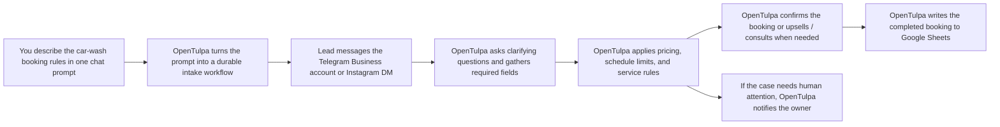

<p align="center">
  
</p>

<h1 align="center">OpenTulpa</h1>

<p align="center">
  <strong>A self-hosted digital employee you can brief in chat.</strong><br/>
  It remembers context, uses real tools, talks to customers on your behalf, completes repetitive work, and can stand up a live inbound worker for Telegram or Instagram from a prompt.
</p>

<p align="center">
  <a href="#why-opentulpa">Why OpenTulpa</a> ·
  <a href="#what-it-actually-does">What It Actually Does</a> ·
  <a href="#quick-start">Quick Start</a> ·
  <a href="docs/ARCHITECTURE.md">Architecture</a> ·
  <a href="docs/DEPLOYMENT.md">Deployment</a> ·
  <a href="docs/E2E_TESTING.md">E2E Testing</a> ·
  <a href="docs/CHAT_COOKBOOK.md">Prompt Cookbook</a>
</p>

---

## Why OpenTulpa

Most agent demos are still chat sessions with tool calls.

OpenTulpa is built for a different job:

- keep state between sessions
- remember how you want work done
- execute real tasks with real side effects
- keep improving as workflows become durable skills and routines
- stay on your infrastructure instead of disappearing into a hosted black box

If you want an agent you can brief once and keep delegating to, that is the point of this repo.

### In one sentence

OpenTulpa is a persistent, self-hosted digital employee for delegated work.

### Two modes that matter

OpenTulpa can work in two distinct ways:

- **As your agent**: you tell it what to do, and it performs research, reporting, automation, and follow-up work for you
- **As your inbound employee**: it talks directly to leads in Telegram Business or Instagram, asks clarifying questions, qualifies them, confirms details, and writes the final result into your system of record

That second mode is important. This is not just an assistant for you. It can also be the first person your customer talks to.

### What that means in business terms

For many workflows, OpenTulpa is closer to:

- a front-desk employee
- a lead qualification rep
- an intake coordinator
- a follow-up operator
- a junior ops person who keeps the process moving

The value is not only that it can answer. The value is that it can own the repetitive part of the workflow end to end.

### Why this is valuable

For a business owner, the value is not "AI replies to messages."

The value is that OpenTulpa can:

- respond to inbound leads immediately
- ask the next missing question instead of losing the lead
- consult the lead using your own rules, pricing, FAQs, and uploaded files
- upsell or clarify service options during the conversation
- collect the exact fields you need before the handoff
- book the lead into the destination system
- escalate or notify the owner when the conversation needs human attention

For Telegram and Instagram intake flows, that setup can happen with no custom code. You describe the rules in chat, OpenTulpa turns them into a durable workflow, and the worker starts handling inbound conversations.

---

## See It Working

The flagship use case is not "ask an agent a question." It is turning one business prompt into a live customer-facing workflow.

Example setup prompt:

```text
Hi, I need you to handle incoming messages in my Telegram. This is for booking a car wash.

For everyone who writes, if it's unclear what they want, ask clarifying questions and then book them for the car wash.

To book a car wash, you need their Telegram username, the date they want to book, the type of wash, and the car (type, model).
Important: You cannot book more than 1 person per hour. The car wash operates only from 8 AM to 11 PM daily.

The cost of the wash depends on the car type, and you need to confirm with the user.
Small car: 1000, SUV: 2500, Truck: 5000.
These are prices for a full wash. Body-only wash costs 500, 1500, 3000 for the car categories above.

Once they've answered all questions and you have enough data, book the person in this Google Sheets: https://docs.google.com/spreadsheets/d/...
```

What OpenTulpa does with that prompt:



That is the product story in one flow: no code setup, live customer-facing conversation, completed operational handoff.

Proof from a live Instagram DM flow:

<p align="center">
  
</p>

In other words, the prompt is not just instructions. It becomes an operating workflow.

---

## What It Actually Does

OpenTulpa is not just "chat with tools."

It combines:

- **Persistent memory** so user context, prior decisions, files, rollups, and artifacts survive across sessions
- **Real execution** through web access, browser automation, generated scripts, internal APIs, and optional third-party integrations
- **Durable workflows** so repeated work becomes reusable skills and scheduled routines
- **Customer-facing conversations** so it can handle inbound leads, ask follow-up questions, confirm details, and complete structured bookings for you
- **Approval gates** so external writes and risky actions require explicit signoff
- **Local ownership** so the state, artifacts, and behavior logs live on your machine or infrastructure

### What makes it different

| | Typical agent app | OpenTulpa |
|---|---|---|
| Memory | Mostly session-bound | Persisted and retrieved automatically |
| Repeated work | Re-prompt every time | Save as skills and routines |
| Execution | Often demo-level | Real tool use, browser work, scripts, APIs |
| Risky actions | Easy to over-trust | Approval gate before external impact |
| Data ownership | Usually vendor-hosted | Local files, SQLite, embedded vector store |
| Availability | Only when prompted | Can run on schedules and wake events |

The important part is that you do not need to write a bot, define a form schema in code, or build a separate flow first. For tightly scoped Telegram and Instagram intake, the prompt is the setup.

---

## What You Can Delegate

### Operational work

- Morning brief: calendar, priorities, conflicts, daily summary
- Monitoring: competitors, pricing pages, status dashboards, error signals
- Research: read links and files, extract decisions, keep a running memory
- Reporting: summarize project changes and draft updates
- Intake: qualify leads, hold multi-turn chats, ask follow-up questions, quote prices, and save bookings when complete

### With integrations enabled

- Telegram conversations and approvals
- Telegram Business lead handling
- Instagram DM handling
- Browser automation with Playwright
- Composio-backed access to third-party tools
- Internal API-driven automations

### A concrete example

> "Handle inbound Telegram Business leads, ask for missing appointment details, use my uploaded FAQ and policy files when needed, and save completed bookings to my sheet."

OpenTulpa can persist that as a durable intake workflow. On each inbound message it reloads the lead's saved state, continues the conversation, asks the next missing question, confirms the slot and price, and only saves the booking once the information is complete.

In other words: you can configure a junior front-desk workflow in chat, and the runtime keeps executing it on every new inbound message.

That means one setup conversation can become:

- a live Telegram Business booking worker
- an Instagram DM intake worker
- a workflow that qualifies, confirms, and records bookings without you manually replying to each lead

### Why this part matters

For structured businesses, this is one of the highest-leverage uses of OpenTulpa:

- you describe the intake rules once in chat
- OpenTulpa turns that into a durable workflow
- leads talk to the agent directly
- the agent gathers missing details over multiple messages
- the final booking or lead record is written into the destination system

That is much closer to replacing repetitive junior-employee work than to ordinary chatbot behavior.

If the workflow is narrow and the rules are clear, setup can be shockingly simple: route the inbound messages to OpenTulpa, describe the intake logic in one prompt, and let it run the process.

The strongest part is that this is a no-code setup path for Telegram and Instagram intake. The prompt defines the worker.

---

## How It Works

At a high level:

```text
capture request -> load durable context -> plan -> execute tools -> gate risky actions -> persist outputs
```

Runtime sketch:

```text
Telegram / Internal API / Events
              |
           FastAPI
              |
      context + state retrieval
              |
        LangGraph runtime
              |
   tools + validation + guardrails
              |
         approval broker
              |
 persist artifacts / skills / routines
              |
     local state on disk (.opentulpa/)
```

Under the hood:

- **FastAPI** for webhook and internal routes
- **LangGraph** for runtime orchestration and tool flow
- **SQLite** for checkpoints, approvals, context, intake, and other durable state
- **Embedded Qdrant** through Mem0 for vector-backed memory
- **Telegram** as the main operator interface

No external database is required by default.

---

## Quick Start

### Requirements

- Python `3.12+`
- [`uv`](https://docs.astral.sh/uv/)
- an OpenAI-compatible API key

### Fastest local setup

```bash
git clone <repo-url>
cd opentulpa
cp .env.example .env
```

Set your API key in `.env`:

```bash
OPENAI_COMPATIBLE_API_KEY=...
```

Run it:

```bash
./start.sh --app
```

Health checks:

- `http://127.0.0.1:8000/healthz`
- `http://127.0.0.1:8000/agent/healthz`

### Runtime config

Default runtime settings live in `opentulpa.config.yaml`.

Recommended model split in this repo:

```yaml
llm_model: z-ai/glm-5.1
llm_reasoning_effort: medium
wake_execution_model: z-ai/glm-5.1
memory_llm_model: google/gemini-3-flash-preview
multimodal_llm: google/gemini-3-flash-preview
guardrail_classifier_model: google/gemini-3-flash-preview
```

This repo currently assumes:

- `DeepSeek V4 Pro` for main chat and wake execution
- `medium` reasoning effort for agent-owned LLM calls by default
- `Gemini Flash` for memory extraction, multimodal work, and guardrail classification
- `MULTIMODAL_LLM` should be set when your main model is not multimodal

When a DeepSeek model is used through OpenRouter, OpenTulpa routes that model through the OpenRouter LangChain adapter so `reasoning_details` are preserved across tool-call loops, which DeepSeek thinking mode requires.

### Telegram setup

Telegram is the main control surface for OpenTulpa.

1. Create a bot with `@BotFather`
2. Add `TELEGRAM_BOT_TOKEN` to `.env`
3. Install `cloudflared` if you want the quick-tunnel manager flow
4. Run `./start.sh`

`start.sh` handles Python dependencies, Playwright Chromium, and tunnel setup.

### Fast inbound setup with Telegram

For a structured lead-intake flow, the setup can be very lightweight:

1. have Telegram Premium on the business account
2. forward incoming messages to OpenTulpa
3. tell OpenTulpa in chat how the intake should work
4. let it handle the conversation and save the completed result

For tightly scoped inbound workflows, this makes setup surprisingly fast because the logic is defined in ordinary chat instead of hardcoded forms or bots.

The important point is not just convenience. It means you can stand up a working intake employee from a single setup conversation instead of building a separate product integration first.

There is no custom bot code required for this setup path. The prompt is the configuration.

### Telegram Business intake

If you want OpenTulpa to work an inbound business inbox:

1. create the bot in `@BotFather`
2. enable Business Mode for that bot
3. connect the bot to the Telegram Business account
4. grant the required business inbox permissions

OpenTulpa then uses the same webhook surface to receive business inbox updates, persist the lead conversation locally, and continue each lead from saved state.

### Instagram setup

Instagram works through the same basic idea: connect the account through OpenTulpa, then let it operate the inbound workflow on your behalf.

For lead handling this means:

1. log into Instagram through OpenTulpa
2. describe the intake behavior in chat
3. let the runtime continue those DM conversations, collect the missing fields, and complete the booking or lead capture flow

That makes Instagram useful as more than a messaging channel. It becomes a place where OpenTulpa can actively do customer-facing work for you.

Again, the key point is that you are not writing Instagram automation code for the intake logic. You describe the workflow in chat and OpenTulpa runs it.

### Docker

```bash
docker build -t opentulpa .
docker run --rm -p 8000:8000 --env-file .env opentulpa
```

The image includes Python dependencies, Node.js/npm, and Playwright.

### Railway

1. Create a Railway project from this repo
2. Add one volume at `/app/opentulpa_data`
3. Set `OPENAI_COMPATIBLE_API_KEY`, `TELEGRAM_BOT_TOKEN`, and `OPENTULPA_DATA_ROOT=/app/opentulpa_data`
4. Optionally set `TELEGRAM_WEBHOOK_SECRET` and `PUBLIC_BASE_URL`
5. Deploy

See [docs/DEPLOYMENT.md](docs/DEPLOYMENT.md) for the full checklist.

### E2E testing

For realistic Telegram, intake, and live-LLM scenario testing, use:

```bash
uv run pytest tests/e2e/scenarios -q -rs
```

The e2e suite uses the same settings loader as the app, so running from the repo root will pick up `.env` automatically.

There is a dedicated guide for:

- live-LLM prerequisites
- Telegram intake workflow e2e commands
- scenario vs live integration tests
- troubleshooting skips and backend/runtime failures

See [docs/E2E_TESTING.md](docs/E2E_TESTING.md).

<details>
<summary><strong>More setup options</strong></summary>

#### Browser automation

Installed by default. Skip it with:

```bash
./start.sh --no-browser-use
```

#### Composio

If you want access to supported third-party apps:

```bash
COMPOSIO_API_KEY=...
```

The callback URL is derived automatically when possible. Override only if needed:

```bash
COMPOSIO_DEFAULT_CALLBACK_URL=https://your-public-base/webhook/composio/callback
```

#### Useful script modes

| Command | Meaning |
|---|---|
| `./start.sh` | Install and run in quick-tunnel manager mode |
| `./start.sh --app` | Install and run in direct app mode |
| `./start.sh install` | Install only |
| `./start.sh run --app` | Run only |

Useful `.env` knobs:

- `START_MODE=auto|app|manager`
- `INSTALL_BROWSER_USE=1|0`
- `INSTALL_CLOUDFLARED=auto|1|0`

</details>

---

## Safety Model

OpenTulpa is designed to be useful without being reckless.

- Read-only and internal actions can proceed directly
- External-impact actions can be forced through an approval gate
- Unclear or higher-risk cases bias toward asking first
- Pending approvals are durable, single-use, and time-limited
- Public exposure is limited to webhook and health routes

For external integrations, read [docs/EXTERNAL_TOOL_SAFETY_CHECKLIST.md](docs/EXTERNAL_TOOL_SAFETY_CHECKLIST.md).

---

## What Gets Stored Locally

OpenTulpa keeps its working state on disk.

- `.opentulpa/` for checkpoints, approvals, context, logs, and databases
- `tulpa_stuff/` for generated artifacts and related working files

That means you can inspect the state, back it up, mount it into a persistent volume, and understand what the agent has been doing.

---

## Docs

| Doc | Why you would read it |
|---|---|
| [Architecture](docs/ARCHITECTURE.md) | Runtime layout, request flows, safety controls, extension points |
| [Deployment](docs/DEPLOYMENT.md) | Local, Docker, and Railway setup |
| [Prompt Cookbook](docs/CHAT_COOKBOOK.md) | Concrete prompt patterns and use cases |
| [External Tool Safety Checklist](docs/EXTERNAL_TOOL_SAFETY_CHECKLIST.md) | Rules for connecting high-impact tools safely |

---

<p align="center">
  <strong>Stop re-explaining. Start delegating.</strong><br/>
  <a href="#quick-start">Run your first persistent agent locally</a>
</p>
