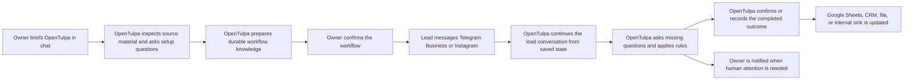

<p align="center">
  
</p>

<h1 align="center">OpenTulpa</h1>

<p align="center">
  <strong>A self-hosted personal agent and digital employee you brief, equip, and delegate to in chat.</strong><br/>
  OpenTulpa keeps context, writes scripts, uses tools, learns workflows, works customer inboxes, and writes outcomes back into your systems.
</p>

<p align="center">
  <a href="#what-opentulpa-is">What It Is</a> ·
  <a href="#general-agent-work">General Agent Work</a> ·
  <a href="#the-employee-loop">Employee Loop</a> ·
  <a href="#customer-facing-work">Customer Work</a> ·
  <a href="#quick-start">Quick Start</a> ·
  <a href="docs/ARCHITECTURE.md">Architecture</a> ·
  <a href="docs/DEPLOYMENT.md">Deployment</a> ·
  <a href="docs/E2E_TESTING.md">E2E Testing</a> ·
  <a href="docs/CHAT_COOKBOOK.md">Prompt Cookbook</a>
</p>

---

## What OpenTulpa Is

OpenTulpa is a persistent, self-hosted agent runtime for delegated work. It is useful as a normal personal assistant first, and as a durable workflow employee when you ask it to keep doing a job.

The product idea is simple: you should be able to ask it to do almost anything a capable assistant could do with a computer, then turn repeated work into something durable.

You can ask one-off questions, hand it files, tell it to research something, ask it to write or run scripts, debug failures, summarize logs, inspect websites, create automations, or prepare workflows. When the job should repeat, you brief it, give it business context, connect the tools it may use, approve the workflow, and then let it keep working from durable state.

That can mean:

- working for you in chat
- writing scripts and artifacts
- debugging errors and retrying with fixes
- running scheduled operational routines
- watching for events and wakeups
- handling inbound Telegram Business or Instagram conversations
- collecting required fields from leads
- using your own source material when answering
- learning preferences, skills, and reusable workflows
- writing completed results into Google Sheets, CRMs, files, or internal systems

The goal is not "AI replies." The goal is an employee-shaped loop: understand the job, use the available context, take the next action, persist state, and hand off exceptions.

---

## General Agent Work

OpenTulpa is not only an inbound-message worker. It is a standard tool-using agent that you can talk to directly.

You can ask it to:

- research a topic and cite what it found
- read and summarize files
- inspect logs and explain failures
- write small scripts or utilities
- run terminal checks and repair failing code
- browse websites or use browser automation
- create generated artifacts
- remember preferences and decisions
- turn repeated instructions into skills
- turn recurring work into scheduled routines
- turn operational processes into durable workflows

It can also recover from routine execution failures: inspect the error, adjust the script or tool arguments, rerun validation, and report what changed. That does not mean it should silently do risky things. External-impact work can still be approval-gated.

The inbound employee mode is one important specialization of this general agent. The broader promise is that OpenTulpa can act like a personal assistant with memory, tools, and the ability to make useful work repeatable.

---

## The Employee Loop

OpenTulpa is built around a durable operating loop:

```text
brief the employee -> equip it with context and tools -> confirm the workflow -> run it -> review logs and outcomes
```

In practice:

1. You explain the job in chat.
2. You attach or point it at the source material it needs.
3. OpenTulpa asks missing setup questions.
4. It prepares durable operating context from the relevant material.
5. It saves the workflow, skill, or routine.
6. It executes the work on future messages, schedules, or events.
7. You inspect logs, approvals, artifacts, bookings, and behavior traces when needed.

This is the core difference from a normal chatbot. OpenTulpa is meant to keep carrying the process, not restart from zero every time.

### Equip The Employee

Source material can be almost anything useful for the job:

- pasted instructions
- PDFs, docs, spreadsheets, CSVs, price lists, FAQs, and policies
- websites and fetched pages
- prior decisions and saved memory
- uploaded files from Telegram
- Google Sheets or other connected app state
- owner corrections during setup
- support-operator edits later
- screenshots or images when multimodal support is configured

The important step is preparation. For broad or messy material, OpenTulpa should inspect the source first, select the relevant parts, compile a smaller workflow knowledge pack, and bind that prepared knowledge to the workflow.

For example, a large price spreadsheet is not treated as a blob that gets pasted into every future prompt. The setup agent inspects the workbook, selects the relevant sheets or rows, creates a Markdown knowledge pack, and attaches that prepared file to the intake worker. The same pattern applies to policies, FAQs, docs, and other business material.

### Tools Complete The Job

OpenTulpa can use tools to move beyond answers:

- browser automation
- web retrieval
- generated scripts
- local files and artifacts
- internal APIs
- Telegram bot and Telegram Business APIs
- Composio-backed third-party tools
- approval-gated external actions

The employee does not just know things. It can do the operational step after it has enough information.

---

## Customer-Facing Work

One of the main use cases is turning a setup conversation into a live inbound worker.

You can say, in ordinary chat:

```text
Handle incoming Telegram Business messages for my car wash.

Ask what service the customer wants, answer pricing questions from the attached materials,
collect name, phone, vehicle, date, and time, then write completed bookings to this Google Sheet.

If the customer asks about a service outside this workflow, politely redirect them to the owner.
Ask me to confirm the workflow before activating it.
```

OpenTulpa should then:



Proof from a live Instagram DM flow:

<p align="center">
  
</p>

For a narrow, well-specified workflow, this is closer to a junior front-desk employee than a generic assistant:

- it responds quickly
- asks the next missing question
- uses the business's rules and source material
- avoids unsupported services instead of inventing answers
- collects the fields needed for handoff
- writes the result into the destination system
- keeps the owner out of routine back-and-forth

---

## What You Can Delegate

OpenTulpa can handle both owner-facing work and customer-facing work.

Owner-facing examples:

- research a topic, links, or uploaded files
- produce reports and summaries
- monitor websites, competitors, dashboards, or error signals
- run scheduled routines and morning briefs
- generate artifacts and scripts
- remember preferences, decisions, and project context

Customer-facing examples:

- qualify inbound leads
- answer service or pricing questions from approved source material
- collect appointment or intake fields over multiple messages
- book or update a customer record
- cancel or change a booking inside an allowed edit window
- escalate exceptions to the owner

The best workflows are narrow and operational. The more clearly you define the job, tools, source material, required fields, and escalation boundary, the more employee-like the result becomes.

---

## What Makes It Different

| Area | Typical agent app | OpenTulpa |
|---|---|---|
| Context | Mostly session-bound | Persistent memory, files, checkpoints, and workflow state |
| Setup | Prompt each time | Brief once, then save durable skills, routines, or intake workflows |
| Knowledge | Ad hoc prompt context | Prepared workflow knowledge bound to the worker |
| Execution | Often demo-level | Real tools, browser work, scripts, APIs, and sink writes |
| Customer inboxes | Usually separate bot code | Telegram Business and Instagram intake can be configured in chat |
| Safety | Easy to over-trust | Approval gates and explicit handoff boundaries |
| Ownership | Vendor black box | Local state, logs, SQLite, and inspectable artifacts |

OpenTulpa is not a form builder and not just a chat UI. It is a runtime for agents that need to keep state and do work.

---

## How It Works

At a high level:

```text
incoming message or request
        |
load durable context, workflow state, files, and memory
        |
plan and call tools through LangGraph
        |
validate risky actions and approval gates
        |
reply, write outputs, or schedule follow-up
        |
persist state, logs, artifacts, and traces
```

Core pieces:

- **FastAPI** for webhooks and internal routes
- **LangGraph** for runtime orchestration and tool loops
- **SQLite** for checkpoints, approvals, context, intake workflows, and bookings
- **Mem0 with embedded Qdrant** for vector-backed memory
- **Telegram** as the main operator interface
- **Telegram Business and Instagram** for customer-facing intake
- **Composio** for optional third-party tools
- **Local files** for artifacts, logs, and prepared workflow knowledge

No external database is required by default.

---

## Quick Start

### Requirements

- Python `3.12+`
- [`uv`](https://docs.astral.sh/uv/)
- an OpenAI-compatible API key

### Run Locally

```bash
git clone <repo-url>
cd opentulpa
cp .env.example .env
```

Set your model API key in `.env`:

```bash
OPENAI_COMPATIBLE_API_KEY=...
```

Start the app:

```bash
./start.sh --app
```

Health checks:

- `http://127.0.0.1:8000/healthz`
- `http://127.0.0.1:8000/agent/healthz`

### Recommended Runtime Models

Default runtime settings live in `opentulpa.config.yaml`.

Recommended model split in this repo:

```yaml
llm_model: z-ai/glm-5.1
llm_reasoning_effort: medium
wake_execution_model: z-ai/glm-5.1
memory_llm_model: google/gemini-3-flash-preview
multimodal_llm: google/gemini-3-flash-preview
guardrail_classifier_model: google/gemini-3-flash-preview
```

This repo currently assumes:

- `GLM 5.1` for main chat and wake execution
- `medium` reasoning effort for agent-owned LLM calls by default
- `Gemini Flash` for memory extraction, multimodal work, guardrail classification, and some test judging
- `MULTIMODAL_LLM` should be set when your main model is not multimodal

DeepSeek V4 Pro is still supported. When a DeepSeek model is used through OpenRouter, OpenTulpa routes it through the OpenRouter LangChain adapter so `reasoning_details` are preserved across tool-call loops, which DeepSeek thinking mode requires.

---

## Telegram And Inbound Setup

Telegram is the main control surface for OpenTulpa.

Basic Telegram bot setup:

1. Create a bot with `@BotFather`.
2. Add `TELEGRAM_BOT_TOKEN` to `.env`.
3. Install `cloudflared` if you want the quick-tunnel manager flow.
4. Run `./start.sh`.

`start.sh` handles Python dependencies, Playwright Chromium, and tunnel setup.

Telegram Business intake setup:

1. Create the bot in `@BotFather`.
2. Enable Business Mode for that bot.
3. Connect the bot to the Telegram Business account.
4. Grant the required business inbox permissions.
5. Brief OpenTulpa in chat and confirm the workflow it proposes.

Once active, OpenTulpa receives business inbox updates, persists each lead conversation, reloads the lead's previous state on each message, and continues the workflow until the outcome is complete or needs escalation.

Instagram works through the same concept: connect the account, brief the intake behavior in chat, then let the runtime continue DM conversations, collect missing fields, and complete the booking or lead capture flow.

---

## Operations

OpenTulpa is designed to be operated, not just demoed.

Useful operational surfaces:

- behavior logs and LLM traces
- `/debug_logs` for server log dumps through Telegram
- approval prompts for risky actions
- durable workflow snapshots
- persisted bookings and sink-write status
- support operator act-as binding for customer tenants
- separate support threads so support setup/debug chat does not pollute the owner's main chat
- fake and live E2E scenarios for Telegram intake and workflow setup

Support operators are trusted operators. They can bind to a customer tenant, debug or set up workflows with owner-level access, and keep their own support conversation history separate from the owner's chat. Customer-facing proactive events still go to the owner by default.

---

## Safety Model

OpenTulpa is designed to be useful without being reckless.

- Read-only and internal actions can proceed directly.
- External-impact actions can be forced through an approval gate.
- Unclear or higher-risk cases bias toward asking first.
- Pending approvals are durable, single-use, and time-limited.
- Public exposure is limited to webhook and health routes.
- Workflow setup asks for confirmation before activation.
- Intake workflows should avoid unsupported services instead of inventing answers.

For external integrations, read [docs/EXTERNAL_TOOL_SAFETY_CHECKLIST.md](docs/EXTERNAL_TOOL_SAFETY_CHECKLIST.md).

---

## Deployment

### Docker

```bash
docker build -t opentulpa .
docker run --rm -p 8000:8000 --env-file .env opentulpa
```

The image includes Python dependencies, Node.js/npm, and Playwright.

### Railway

1. Create a Railway project from this repo.
2. Add one volume at `/app/opentulpa_data`.
3. Set `OPENAI_COMPATIBLE_API_KEY`, `TELEGRAM_BOT_TOKEN`, and `OPENTULPA_DATA_ROOT=/app/opentulpa_data`.
4. Optionally set `TELEGRAM_WEBHOOK_SECRET` and `PUBLIC_BASE_URL`.
5. Deploy.

See [docs/DEPLOYMENT.md](docs/DEPLOYMENT.md) for the full checklist.

---

## E2E Testing

For realistic Telegram, intake, and live-LLM scenario testing:

```bash
uv run pytest tests/e2e/scenarios -q -rs
```

The E2E suite uses the same settings loader as the app, so running from the repo root will pick up `.env` automatically.

See [docs/E2E_TESTING.md](docs/E2E_TESTING.md) for live-LLM prerequisites, Telegram intake workflow commands, scenario-vs-live integration notes, and troubleshooting.

---

## More Setup Options

### Browser Automation

Installed by default. Skip it with:

```bash
./start.sh --no-browser-use
```

### Composio

If you want access to supported third-party apps:

```bash
COMPOSIO_API_KEY=...
```

The callback URL is derived automatically when possible. Override only if needed:

```bash
COMPOSIO_DEFAULT_CALLBACK_URL=https://your-public-base/webhook/composio/callback
```

### Script Modes

| Command | Meaning |
|---|---|
| `./start.sh` | Install and run in quick-tunnel manager mode |
| `./start.sh --app` | Install and run in direct app mode |
| `./start.sh install` | Install only |
| `./start.sh run --app` | Run only |

Useful `.env` knobs:

- `START_MODE=auto|app|manager`
- `INSTALL_BROWSER_USE=1|0`
- `INSTALL_CLOUDFLARED=auto|1|0`

---

## What Gets Stored Locally

OpenTulpa keeps its working state on disk.

- `.opentulpa/` for checkpoints, approvals, context, logs, databases, file vaults, and prepared workflow knowledge
- `tulpa_stuff/` for generated artifacts and related working files

That means you can inspect the state, back it up, mount it into a persistent volume, and understand what the employee has been doing.

---

## Docs

| Doc | Why you would read it |
|---|---|
| [Architecture](docs/ARCHITECTURE.md) | Runtime layout, request flows, safety controls, extension points |
| [Deployment](docs/DEPLOYMENT.md) | Local, Docker, and Railway setup |
| [E2E Testing](docs/E2E_TESTING.md) | Realistic workflow and intake validation |
| [Prompt Cookbook](docs/CHAT_COOKBOOK.md) | Concrete prompt patterns and use cases |
| [External Tool Safety Checklist](docs/EXTERNAL_TOOL_SAFETY_CHECKLIST.md) | Rules for connecting high-impact tools safely |

---

<p align="center">
  <strong>Stop re-explaining. Start delegating.</strong><br/>
  <a href="#quick-start">Run your first self-hosted digital employee</a>
</p>
